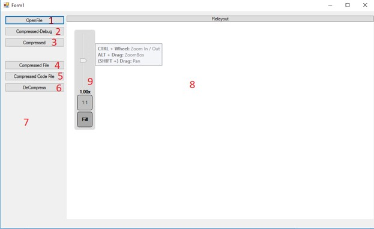
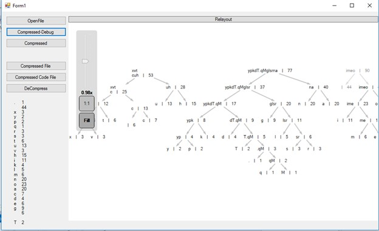
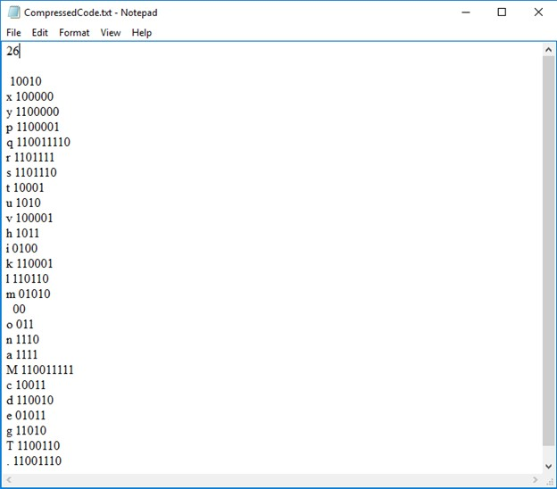
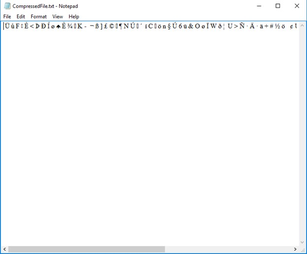

# Demo for Huffman Coding

This project was implemented from scratch by [AcidHimKoPhim](https://github.com/AcidHimKoPhim). The project was a course project for the Design and Analysis of Algorithms class at Vietnam National University HCMC, University of Information Technology [UIT](https://en.uit.edu.vn/). Year of conducting the project: 2015.

##Requirements
- Microsoft Visual 2012 (recommended)
- C# 5.0

## Use

Open `WindowsFormsApplication1.sln` and run the project. 

Explanation:
1: Open the file to be compressed.
2: Debug mode on how to create Huffman tree.
3: Visualization of building Huffman tree and compression.
4: Open the compressed file `CompressedFile.txt`
5: Open `CompressedCode.txt` containing characters and its compressing code.
6: Uncompress the `CompressedFile.txt` using the code in `CompressedCode.txt`. The result is stored in `Extract.txt`.
7: Visualization of the Hashtable during compression.
8: Window for visualization of building Huffman Tree.
9: Zoom in and zoom out to see the nodes.

Generating Huffman Tree.

Visualization of `CompressedCode.txt` after the compression of `Taytien.txt`. The first line contains an integer number indicating numbers of pair <character - code>. The rests are characters and their corresponding codes.

Visualization of `CompressedFile.txt` after the compression of `Taytien.txt`. 

Visualization of `ExtractFile.txt` after decompressing the file `CompressedFile.txt`. 